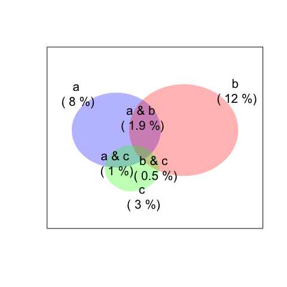

# Making Venn chart

### This function takes three-variable values and their overlapped values and fit to a Venn chart. 

(The value of where three variables overlap may not fit exactly.)
 
### [See Examples](rmdfiles/Demo_vennchart.md) 
 
 
